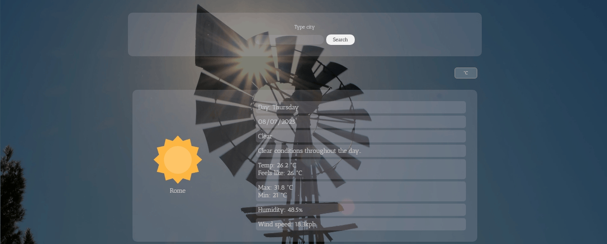
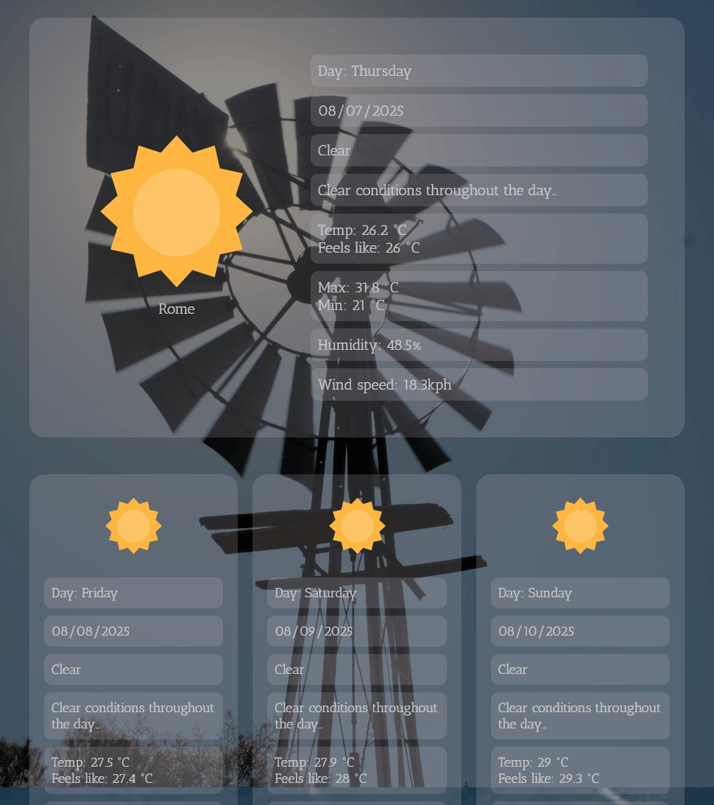
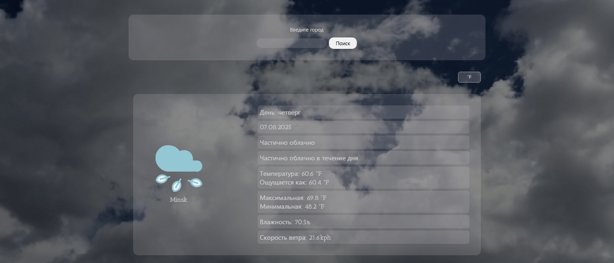
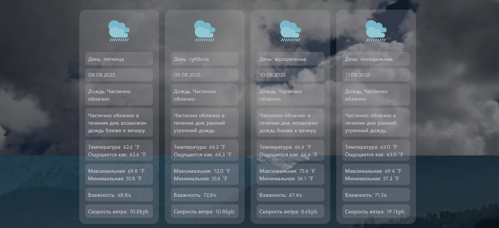
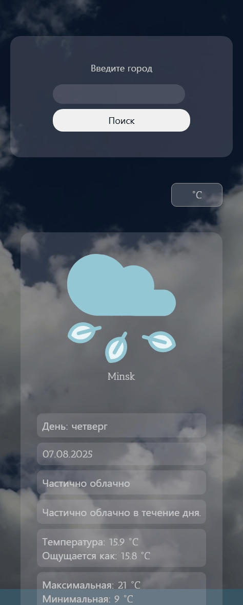

# Weather Forecast App

A responsive, dynamic weather application built as part of **The Odin Project** JavaScript curriculum. Users can search any city to see current conditions and a 14-day forecast. The app integrates the Visual Crossing Weather API for data, the Giphy API for a fun loading animation, and dynamic background videos that adapt to the weather. Temperature units toggle between Celsius and Fahrenheit, and the interface automatically displays in English or Russian based on the user’s browser settings.

---

## 📚 Assignment

This project fulfills the [Weather App assignment](https://www.theodinproject.com/lessons/javascript-weather-app) from The Odin Project’s JavaScript course.

---

## 🚀 Features

- Search for weather by city name
- View current weather and a 14-day forecast
- Toggle between °C and °F
- Dynamic background video for each weather condition
- Giphy-powered animated loader
- Automatic UI language switch (English/Russian) based on browser locale
- Fully responsive design (mobile, tablet, desktop)

---

## 🛠 Technologies

- HTML5 & CSS3 (Grid, Flexbox)
- Vanilla JavaScript (ES6+, async/await, Promises)
- Webpack 5 (asset modules)
- Visual Crossing Weather API
- Giphy API

---

## 📸 Screenshots

**English UI**

**Русский интерфейс**

